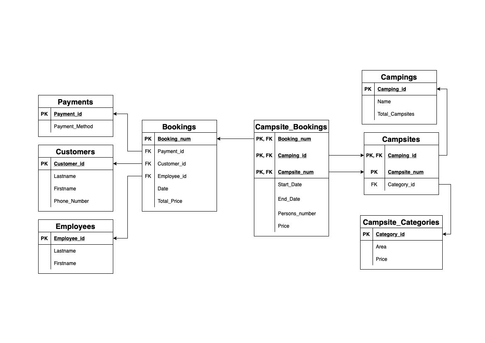

# Coding Factory 2022 - Database Design Project

## 
**Σύστημα Κρατήσεων Κατασκηνώσεων**

---
 

### Α) <u>Σχεδιασμός Λογικού Σχήματος Β.Δ:</u>

* Δημιουργία Βασικής Σχέσης:

    Αρχικά επιλέγουμε όλα τα γνωρίσματα που χρειάζεται να καταγραφούν στη βάση δεδομένων και τα εντάσσουμε σε μία αρχική σχέση:

    >**Κράτηση(Αριθμός Κράτησης, Ημερομηνία, Κωδικός Πληρωμής, Τρόπος Πληρωμής, Επώνυμο Πελάτη, 'Ονομα Πελάτη, Κωδικός Πελάτη, Τηλέφωνο Επικοινωνίας, Κωδικός Υπαλλήλου, Επώνυμο Υπαλλήλου, Όνομα Υπαλλήλου, Κωδικός Κατασκήνωσης, Όνομα Κατασκήνωσης, Σύνολο Θέσεων, Αριθμός Θέσης, Κατηγορία Θέσης, Έκταση Θέσης, Κόστος Θέσης, Ημερομηνία Έναρξης, Ημερομηνία Λήξης, Αριθμός Ατόμων, Κόστος, Συνολικό Κόστος)**
    
    ---

* Πρώτη Κανονικοποιημένη Μορφή (1NF):

    1. Παρατηρούμε ότι η σχέση δεν έχει γνωρίσματα που δέχονται σύνθετες τιμές.

    2. Επιλέγουμε ως πρωτεύον κλειδί τον **Αριθμό Κράτησης**.

    3. Εντοπίζουμε τα γνωρίσματα που δέχονται διαφορετικές τιμές για μία τιμή του πρωτεύοντος κλειδιού:
    
        * Κωδικός Κατασκήνωσης 
        * Όνομα Κατασκήνωσης 
        * Σύνολο Θέσεων 
        * Αριθμός Θέσης 
        * Κατηγορία Θέσης 
        * Έκταση Θέσης 
        * Κόστος Θέσης
        * Ημερομηνία Έναρξης 
        * Ημερομηνία Λήξης 
        * Αριθμός Ατόμων
        * Κόστος

    4. Δημιουργούμε μία νέα σχέση που περιλαμβάνει τα παραπάνω γνωρίσματα και τα αφαιρούμε από την αρχική:

        > **Κράτηση(Αριθμός Κράτησης#, Ημερομηνία, Κωδικός Πληρωμής, Τρόπος Πληρωμής, Επώνυμο Πελάτη, 'Ονομα Πελάτη, Κωδικός Πελάτη, Τηλέφωνο Επικοινωνίας, Κωδικός Υπαλλήλου, Επώνυμο Υπαλλήλου, Όνομα Υπαλλήλου, Συνολικό Κόστος)**
        >
        >**Θέση(Αριθμός Κράτησης#, Κωδικός Κατασκήνωσης#, Όνομα Κατασκήνωσης, Σύνολο Θέσεων, Αριθμός Θέσης#, Κατηγορία Θέσης, Έκταση Θέσης, Κόστος Θέσης, Ημερομηνία Έναρξης, Ημερομηνία Λήξης, Αριθμός Ατόμων, Κόστος)**
    
---

* Δεύτερη Κανονικοποιημένη Μορφή (2NF):

    1. Η πρώτη σχέση (**Κράτηση**) περιέχει απλό πρωτεύον κλειδί, συνεπώς είναι ήδη στη 2NF. 

    2. Στη δεύτερη σχέση (**Θέση**) παρατηρούμε ότι δεν υπάρχει πλήρης συναρτησιακή εξάρτηση από το πρωτεύον κλειδί. Τα γνωρίσματα *Όνομα Κατασκήνωσης* και *Σύνολο Θέσεων* εξαρτώνται από τον *Κωδικός Κατασκήνωσης*, ο οποίος είναι υποσύνολο του κλειδιού.

    3. Επομένως, δημιουργούμε μια νέα σχέση που περιλαμβάνει αυτά τα γνωρίσματα και τα αφαιρούμε από τη **Θέση**:

        > **Κράτηση(Αριθμός Κράτησης#, Ημερομηνία, Κωδικός Πληρωμής, Τρόπος Πληρωμής, Επώνυμο Πελάτη, 'Ονομα Πελάτη, Κωδικός Πελάτη, Τηλέφωνο Επικοινωνίας, Κωδικός Υπαλλήλου, Επώνυμο Υπαλλήλου, Όνομα Υπαλλήλου, Συνολικό Κόστος)**
        >
        >**Κατασκήνωση(Κωδικός Κατασκήνωσης#, Όνομα Κατασκήνωσης, Σύνολο Θέσεων)**
        >
        >**Θέση(Αριθμός Κράτησης#, Κωδικός Κατασκήνωσης#, Αριθμός Θέσης#, Κατηγορία Θέσης, Έκταση Θέσης, Κόστος Θέσης, Ημερομηνία Έναρξης, Ημερομηνία Λήξης, Αριθμός Ατόμων, Κόστος)**
    
    4. Όμως, η **Θέση** εξακολουθεί να μην είναι στη 2NF. Τα γνωρίσματα *Κατηγορία Θέσης*, *Έκταση Θέσης* και *Κόστος Θέσης* παρουσιάζουν μερική εξάρτηση από το κλειδί, αφού δεν εξαρτώνται από τον *Αριθμό Κράτησης*. Επομένως, η **Θέση** θα σπάσει σε δύο σχέσεις και τελικά θα έχουμε τις εξής:

        > **Κράτηση(Αριθμός Κράτησης#, Ημερομηνία, Κωδικός Πληρωμής, Τρόπος Πληρωμής, Επώνυμο Πελάτη, 'Ονομα Πελάτη, Κωδικός Πελάτη, Τηλέφωνο Επικοινωνίας, Κωδικός Υπαλλήλου, Επώνυμο Υπαλλήλου, Όνομα Υπαλλήλου, Συνολικό Κόστος)**
        >
        >**Κατασκήνωση(Κωδικός Κατασκήνωσης#, Όνομα Κατασκήνωσης, Σύνολο Θέσεων)**
        >
        >**Κράτηση_Θέσης(Αριθμός Κράτησης#, Κωδικός Κατασκήνωσης#, Αριθμός Θέσης#, Ημερομηνία Έναρξης, Ημερομηνία Λήξης, Αριθμός Ατόμων, Κόστος)**
        >
        >**Θέση(Κωδικός Κατασκήνωσης#, Αριθμός Θέσης#, Κατηγορία Θέσης, Έκταση Θέσης, Κόστος Θέσης)**

    
    ---

* Τρίτη Κανονικοποιημένη Μορφή (3NF):

    1. Για να μετατρέψουμε τις σχέσεις στην 3NF, πρέπει να εντοπίσουμε τις μεταβατικές εξαρτήσεις.
    
    2. Στην πρώτη σχέση (**Κράτηση**), παρατηρούμε ότι τα εξής γνωρίσματα παρουσιάζουν εξάρτηση από αλλά γνωρίσματα που δεν ανήκουν στο πρωτεύον κλειδί:
        
        * Τρόπος Πληρωμής από Κωδικό Πληρωμής.
        * Επώνυμο Πελάτη, 'Ονομα Πελάτη και Τηλέφωνο Επικοινωνίας από Κωδικό Πελάτη.
        * Επώνυμο Υπαλλήλου και Όνομα Υπαλλήλου από Κωδικό Υπαλλήλου.
    
    3. Επομένως, καταλήγουμε στις εξής σχέσεις:
        
        > **Κράτηση(Αριθμός Κράτησης#, Ημερομηνία, Κωδικός Πληρωμής,Κωδικός Πελάτη, Κωδικός Υπαλλήλου, Συνολικό Κόστος)**
        >
        > **Πληρωμή(Κωδικός Πληρωμής#, Τρόπος Πληρωμής)**
        >
        > **Πελάτης(Κωδικός Πελάτη#, Επώνυμο Πελάτη, 'Ονομα Πελάτη, Τηλέφωνο Επικοινωνίας)**
        >
        > **Υπάλληλος(Κωδικός Υπαλλήλου#, Επώνυμο Υπαλλήλου, Όνομα Υπαλλήλου)**
        
    4. Στη δεύτερη (**Κατασκήνωση**) και στην τρίτη (**Κράτηση_Θέσης**) σχέση δεν υπάρχει κάποια μεταβατική εξάρτηση, άρα βρίσκονται ήδη στην 3NF.
    
    5. Στην τέταρτη σχέση (**Θέση**), παρατηρούμε ότι η *Έκταση Θέσης* και το *Κόστος Θέσης* εξαρτώνται από την *Κατηγορία Θέσης*. Άρα:
        
        > **Θέση(Κωδικός Κατασκήνωσης#, Αριθμός Θέσης#, Κατηγορία Θέσης)**
        >
        > **Κατηγορία(Κατηγορία Θέσης#, Έκταση Θέσης, Κόστος Θέσης)**

    
    ---

Συγκεντρωτικά, μετά την κανονικοποίηση καταλήγουμε στις εξής σχέσεις:

1. **Κράτηση(Αριθμός Κράτησης#, Ημερομηνία, Κωδικός Πληρωμής, Κωδικός Πελάτη, Κωδικός Υπαλλήλου, Συνολικό Κόστος)**

2. **Πληρωμή(Κωδικός Πληρωμής#, Τρόπος Πληρωμής)**

3. **Πελάτης(Κωδικός Πελάτη#, Επώνυμο Πελάτη, 'Ονομα Πελάτη, Τηλέφωνο Επικοινωνίας)**

4. **Υπάλληλος(Κωδικός Υπαλλήλου#, Επώνυμο Υπαλλήλου, Όνομα Υπαλλήλου)**

5. **Κατασκήνωση(Κωδικός Κατασκήνωσης#, Όνομα Κατασκήνωσης, Σύνολο Θέσεων)**

6. **Κράτηση_Θέσης(Αριθμός Κράτησης#, Κωδικός Κατασκήνωσης#, Αριθμός Θέσης#, Ημερομηνία Έναρξης, Ημερομηνία Λήξης, Αριθμός Ατόμων, Κόστος)**

7. **Θέση(Κωδικός Κατασκήνωσης#, Αριθμός Θέσης#, Κατηγορία Θέσης)**

8. **Κατηγορία(Κατηγορία Θέσης#, Έκταση Θέσης, Κόστος Θέσης)**

--- 

Ακολουθεί το σχήμα της βάσης σε γραφική αναπαράσταση:

### Β) <u>Υλοποίηση Λογικού Σχήματος Β.Δ σε MS SQL SERVER:</u>

* Δημιουργία Βάσης Δεδομένων:

        CREATE DATABASE Camping
        COLLATE Greek_CI_AS;
        GO
    
    Χρησιμοποιούμε την εντολή *COLLATE* ώστε η βάση μας να δέχεται ελληνικούς χαρακτήρες.

* Υλοποίηση πινάκων:

    * Πίνακας **Payments**
            
            CREATE TABLE Payments (
            Payment_id VARCHAR(2) PRIMARY KEY,
            Payment_Method VARCHAR(30)
            );

    * Πίνακας **Customers**
            
            CREATE TABLE Customers (
                Customer_id NUMERIC IDENTITY(1,1) PRIMARY KEY,
                Lastname VARCHAR(50) NOT NULL,
                Firstname VARCHAR(50) NOT NULL,
                Phone_number VARCHAR(30) NOT NULL,
            );

        Χρησιμοποιούμε την εντολή *IDENTITY(1,1)*, ώστε το πρωτεύον κλειδί του πίνακα να δέχεται αυτόματα τιμές σε αύξουσα σειρά

    * Πίνακας **Employees**
            
            CREATE TABLE Employees (
                Employee_id NUMERIC IDENTITY(1,1) PRIMARY KEY,
                Lastname VARCHAR(50) NOT NULL,
                Firstname VARCHAR(50) NOT NULL,
            );

        Χρησιμοποιούμε την εντολή *IDENTITY(1,1)*, ώστε το πρωτεύον κλειδί του πίνακα να δέχεται αυτόματα τιμές σε αύξουσα σειρά.

    * Πίνακας **Bookings**
            
            CREATE TABLE Bookings (
                Booking_num NUMERIC IDENTITY(1,1) PRIMARY KEY,
                Payment_id VARCHAR(2) NOT NULL,
                Customer_id NUMERIC NOT NULL,
                Employee_id NUMERIC NOT NULL,
                Booking_date DATE DEFAULT GETDATE(),
                CONSTRAINT FK_Bookings_Payments 
                    FOREIGN KEY (Payment_id) 
                    REFERENCES Payments(Payment_id),
                CONSTRAINT FK_Bookings_Customers 
                    FOREIGN KEY (Customer_id) 
                    REFERENCES Customers(Customer_id),
                CONSTRAINT FK_Bookings_Employees 
                    FOREIGN KEY (Employee_id) 
                    REFERENCES Employees(Employee_id),
            );

        Χρησιμοποιούμε την εντολή *IDENTITY(1,1)*, ώστε το πρωτεύον κλειδί του πίνακα να δέχεται αυτόματα τιμές σε αύξουσα σειρά.
        
        Τα πεδία *Payment_id*, *Customer_id*, και *Employee_id*, αποτελούν ξένα κλειδιά.

    * Πίνακας **Campings**
            
            CREATE TABLE Campings(
                Camping_id VARCHAR(3) PRIMARY KEY,
                Camping_name VARCHAR(20) NOT NULL,
                Total_Campsites INT
            );

        Το πεδίο *Total_Campsites* μπορεί να δεχθεί την τιμή **NULL**, ώστε να μπορούν να προστίθενται κατασκηνώσεις, χωρίς να έχει οριστικοποιηθεί ο αριθμός των θέσεων τους από την αρχή.  

    * Πίνακας **Campsite_Categories**
            
            CREATE TABLE Campsite_Categories(
                Category_id VARCHAR(2) PRIMARY KEY,
                Area NUMERIC(5,2) NOT NULL,
                Price MONEY NOT NULL,
                CONSTRAINT CK_Campsite_Categories_Price 
                    CHECK (Price > 0),
                CONSTRAINT CK_Campsite_Categories_Area 
                    CHECK (Area > 0)
            );

        Τα πεδία *Area* και *Price* έχουν του αντίστοιχους περιορισμούς ώστε να δέχονται μόνο θετικές τιμές.

    * Πίνακας **Campsites**
            
            CREATE TABLE Campsites(
                Camping_id VARCHAR(3) NOT NULL,
                Campsite_num INT NOT NULL,
                PRIMARY KEY (Camping_id, Campsite_num),
                Category_id VARCHAR(2) NOT NULL,
                CONSTRAINT FK_Campsites_Campings 
                    FOREIGN KEY (Camping_id) 
                    REFERENCES Campings (Camping_id),
            );

        Το πεδίο *Camping_id* αποτελεί ξένο κλειδί.

    * Πίνακας **Campsite_Bookings**
            
            CREATE TABLE Campsite_Bookings(
                Booking_num NUMERIC NOT NULL,
                Camping_id VARCHAR(3) NOT NULL,
                Campsite_num INT NOT NULL,
                PRIMARY KEY (Booking_num, Camping_id, Campsite_num),
                Start_date DATE NOT NULL,
                End_date DATE NOT NULL,
                Persons_number INT NOT NULL,
                CONSTRAINT FK_Campsite_Bookings_Campsites 
                    FOREIGN KEY (Camping_id, Campsite_num) 
                    REFERENCES Campsites (Camping_id, Campsite_num),   
                CONSTRAINT FK_Campsite_Bookings_Bookings 
                    FOREIGN KEY (Booking_num) 
                    REFERENCES Bookings (Booking_num),
                CONSTRAINT CK_Booking_Dates 
                    CHECK (Start_date <= End_date) 
            );

        Τα πεδία *Camping_id* και *Campsite_num*, καθώς και το πεδίο *Booking_num*, αποτελούν ξένα κλειδιά.

        Ο πίνακας διαθέτει περιορισμό τύπου *CHECK*, ώστε η ημερομηνία λήξης της κράτησης να μην προηγείται της ημερομηνίας έναρξης.

* Δημιουργία υπολογιζόμενων στηλών:

    * Στήλη **Price** στον πίνακα **Campsite_Bookings**:
        
        Συνάρτηση *CampsiteBookingPrice*:
        
            USE Camping;
            GO

            CREATE FUNCTION dbo.ufn_CampsiteBookingPrice (
                @Persons INT, @CampID VARCHAR(3), @SiteNum INT
                )
            RETURNS MONEY
            AS
            BEGIN
                DECLARE @PricePerPerson MONEY;
                DECLARE @TotalPrice MONEY;
                
                SELECT @PricePerPerson = Price
                FROM Campsite_Categories
                INNER JOIN Campsites
                ON Campsite_Categories.Category_id = 
                    Campsites.Category_id
                AND Camping_id = @CampID
                AND Campsite_num = @SiteNum;

                SELECT @TotalPrice = 
                    @PricePerPerson * @Persons;
                RETURN @TotalPrice; 
            END;
            GO
        
        Τροποποίηση πίνακα **Campsite_Bookings**:

            ALTER TABLE Campsite_Bookings
            ADD Price 
            AS dbo.ufn_CampsiteBookingPrice(
                Persons_number, Camping_id, Campsite_num
                );   
    
    * Στήλη **TotalPrice** στον πίνακα **Bookings**:
        
        Συνάρτηση *BookingTotalPrice*:
        
            USE Camping;
                GO

                CREATE FUNCTION dbo.ufn_BookingTotalPrice (
                    @BookingNum NUMERIC
                    )
                RETURNS MONEY
                AS
                BEGIN
                    DECLARE @TotalPrice MONEY;

                    SELECT @TotalPrice = SUM(Price)
                    FROM Campsite_Bookings
                    WHERE @BookingNum = Booking_num;

                    RETURN @TotalPrice;
                END;
                GO
        
        Τροποποίηση πίνακα **Bookings**:

            ALTER TABLE Bookings
            ADD Total_price 
            AS dbo.ufn_BookingTotalPrice(Booking_num);   

    Η παραπάνω λειτουργικότητα θα μπορούσε να επιτευχθεί και με τη δημιουργία κατάλληλου *View*, αντί της χρήσης υπολογιζόμενων στηλών στους πίνακες της Β.Δ.
 

* Προσθήκη περιορισμών πεδίων τύπου *CHECK*:
    
    Δημιουργία συνάρτησης *CheckCampsiteNum*:
        
            USE Camping;
            GO

            CREATE FUNCTION dbo.ufn_CheckCampsiteNum(
                @CampID VARCHAR(3), @CampNum INT
                )
            RETURNS VARCHAR(5)
            AS
            BEGIN
                DECLARE @MaxCampNum INT;

                SELECT @MaxCampNum = Total_Campsites
                FROM Campings
                WHERE Camping_id = @CampID

                IF (@MaxCampNum >= @CampNum) 
                    RETURN 'True';
                RETURN 'False';
            END;
            GO

     

    Τροποποίηση πίνακα **Campsites**, ώστε να δέχεται περιορισμό σύμφωνα με το αποτέλεσμα της συνάρτηση *CheckCampsiteNum*:

        USE Camping;
        GO

        ALTER TABLE Campsites
        ADD CONSTRAINT CK_Campsites_num 
            CHECK (
                dbo.ufn_CheckCampsiteNum(
                    Camping_id, Campsite_num) = 'True'
                );

     
    Δημιουργία συνάρτησης *CheckBookingDate*:
        
            USE Camping;
            GO

            CREATE FUNCTION dbo.ufn_CheckBookingDate(@BookingNum NUMERIC, @Date DATE)
            RETURNS VARCHAR(5)
            AS
            BEGIN
                DECLARE @BookingDate DATE;

                SELECT @BookingDate = Booking_date
                FROM Bookings
                WHERE Booking_num = @BookingNum

                IF (@Date >= @BookingDate) 
                    RETURN 'True';
                RETURN 'False';
            END;
            GO

     

    Τροποποίηση πίνακα **Campsite_Bookings**, ώστε οι ημερομηνίες έναρξης και λήξης της κράτησης να μην προηγούνται της ημερομηνίας κράτησης:

        USE Camping;
        GO

        ALTER TABLE Campsite_Bookings
        ADD CONSTRAINT CK_Start_Date 
            CHECK (
                dbo.ufn_CheckBookingDate(
                    Booking_num, Start_date) = 'True'
            );

        ALTER TABLE Campsite_Bookings
        ADD CONSTRAINT CK_End_Date 
            CHECK (
                dbo.ufn_CheckBookingDate(
                    Booking_num, End_date) = 'True'
            );

    Ο έλεγχος της ημερομηνίας λήξης θα μπορούσε να παραληφθεί, αφού ήδη ελέγχουμε ότι δεν προηγείται της ημερομηνίας έναρξης, επομένως επαγωγικά δε θα μπορούσε να προηγείται ούτε της ημερομηνίας κράτησης.